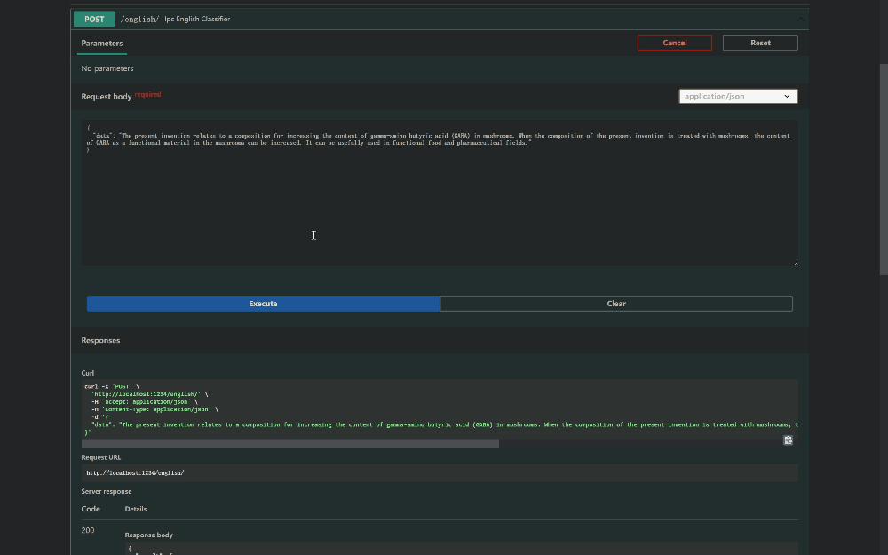

# 基于Paddle进行文本分类

## 🎨 语言

- [English](/README.md)
- [中文](/README-zh.md)

## 📝 描述

这个程序是基于`Paddle`框架进行`文本分类`

文本可以是`中文`或者`英文`，模型选用`单语言模型`，也就是说你必须知道输入的文本是中文还是英文，然后来调用相应的模型进行预测。

所使用的单语言模型：

* 中文文本分类： `hfl/roberta-wwm-ext-large`
* 英文文本分类： `ernie-2.0-large-en`

当然，你也可以选择`多语言模型`进行训练，可能准确率不如单语言模型

## ⚙ 环境

* 使用  `1 * NVIDIA Tesla V100 32G` 进行训练（推荐）。请确保CUDA等已经安装成功
* 当然，你也可以使用CPU来进行训练

## 🛠 库依赖

* Python 3.9
* paddlepaddle 2.1.3
  * 如果你用CPU进行训练，那么安装 `CPU only` 版本
  * 如果你用GPU进行训练，那么请根据你的GPU和CUDA安装正确的GPU版本。
    比如：paddlepaddle-gpu==2.1.3.post101
* paddlenlp 2.1.0

如果你想要部署模型，你还需要安装：

* fastapi 0.79
* uvicorn 0.18.2

## 📚 文件

* 主要有2个文件夹：
  * `1-train`: 用来训练得到能够进行预测的模型
  * `2-deploy`: 用来部署训练得到的模型，作为API
* 程序主要使用了 `Jupyter Notebook` 。你也可把 `.ipynb` 转换为 `.py`
* 文件前面的序号是你需要运行的顺序
* 比如，你会先运行 `1-xxx.ipynb` ，然后运行 `2-xxx.ipynb`
* `1-train/checkpoint` 和 `2-deploy/models` 文件夹中的文件都是假文件，真正的文件需要你通过训练得到

## 📖 数据

* data文件夹中的文件只是一些样例数据

* 你需要把你的data转换为一个 `csv` 文件，并且使用 `\t` 来进行分割

* 样例数据：

  | text_a                                                | label |
  | ----------------------------------------------------- | ----- |
  | Do you ever get a little bit tired of life            | A     |
  | Like you're not really happy but you don't wanna die  | B     |
  | ...                                                   | ...   |
  | Like you're hangin' by a thread but you gotta survive | B     |
  | 'Cause you gotta survive                              | C     |

* 你必须确保在文本和标签中没有 `\t`。`重要！！！`
* 你需要把data分成 train(80%) 和 test(20%) ，你可以自己指定划分的比例

## 🎯 运行

可能有些东西需要你自己进行调整。比如：路径

* 步骤1：运行 `train.ipynb` 。运行后，在 `checkpoint` 文件夹中会生成训练后的模型
  * 如果你的文本是中文的，请运行 `1.1-train_Chinese.ipynb`
  * 如果你的文本是英文的，请运行 `1.2-train_English.ipynb`
* 步骤2（可选）：运行 `2-evaluate.ipynb` 。运行后，可以得到分类报告
* 步骤3（可选）：运行 `3-predict.ipynb` 。运行后，可以读取文件进行批量预测
* 步骤4（可选）：运行 `4-predict_only_one.ipynb` 。运行后，可以单独预测一条文本
* 步骤5：运行 `5-to_static.ipynb` 。运行后，可以得到能够部署的静态图模型
* 步骤6（可选）：运行 `6-infer.ipynb` 。用来测试部署

## 📢 部署

得到能够部署的静态图模型后，可以使用 FastAPI 或者其他 API 框架进行部署。

把训练和转换得到的模型放到 `2-deploy/models/English` 或者 `2-deploy/models/Chinese` 中，并且让它们像下面这个样子：

* label_map.json
* model.pdiparams
* model.pdiparams.info
* model.pdmodel
* tokenizer_config.json
* vocab.txt

运行： `python main.py`

访问： `localhost:1234/docs` 查看文档

## 💡 其他

PaddlePaddle 、 PaddleNLP 和 FastAPI 的文档：

* [PaddlePaddle](https://www.paddlepaddle.org.cn/documentation/docs/zh/guides/index_cn.html)
* [PaddleNLP](https://paddlenlp.readthedocs.io/zh/latest/)
* [FastAPI](https://fastapi.tiangolo.com/zh/)

